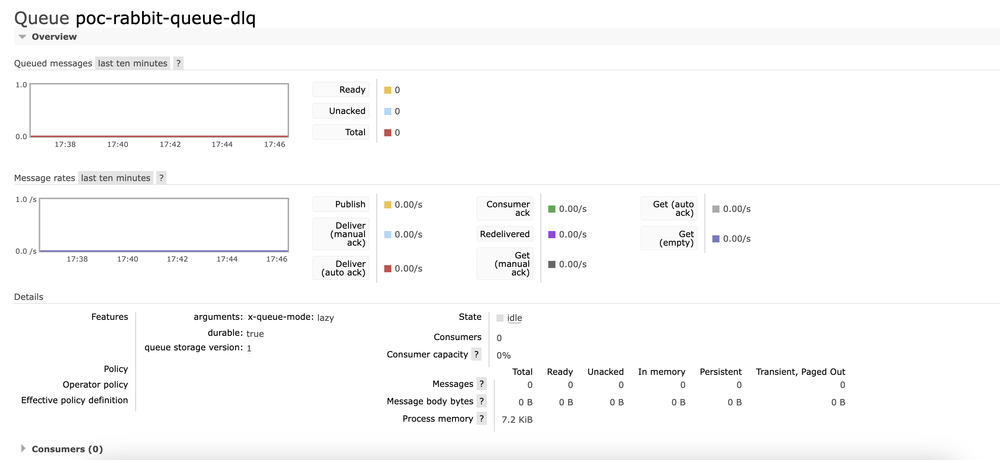

# Rabbit MQ Implementation

The RabbitMQ Application is a [Spring Boot](https://spring.io/projects/spring-boot) based messaging application that uses [RabbitMQ](https://www.rabbitmq.com/) as a message broker for communication. It demonstrates basic message producer and consumer functionality.

## Prerequisites

Before you begin, ensure you have RabbitMQ server installed and running. You can install RabbitMQ using [Homebrew](https://brew.sh/) (macOS/Linux) or follow the official [RabbitMQ installation guide](https://www.rabbitmq.com/download.html).

### RabbitMQ Setup via Homebrew

1. Install RabbitMQ
```
brew install rabbitmq
```

2. Start the RabbitMQ Server
```
brew services start rabbitmq
```

3. Verify the Installation
```
brew services list
```

RabbitMQ comes with a web-based management console that you can access to monitor and manage your RabbitMQ server. To access the management console, open a web browser and go to:

http://localhost:15672/

You can log in using the default credentials:

Username: `guest`
Password: `guest`

**Notes:**
To have the RabbitMQ server operational, we must first terminate the ActiveMQ service (if any) since they both share port 1883.

### Configure RabbitMQ

#### Create Dead Letter Exchange

Create a Dead Letter Exchange `poc-dead-letter-exchange` with below properties:
```
Type: fanout
Durability: durable
Auto delete: no
Internal: yes
```
**Notes:**
Dead Letter Exchange is dedicated to redirect the rejected messages.


#### Create Queue and Dead Letter Queue

Create a queue `poc-rabbit-queue` to store the incoming requests with below properties:
```
Durability: durable
Auto delete: no
Arguments:
- x-queue-mode=lazy
- x-dead-letter-exchange=poc-dead-letter-exchange
```


Create a Dead Letter Queue (DLQ) `poc-rabbit-queue-dlq` to store the rejected messages with below properties:
```
Durability: durable
Auto delete: no
Arguments:
- x-queue-mode=lazy
```



#### Binding to the Queues

1. `poc-rabbit-queue`
```
From exchange: amq.direct
Routing key: poc-rabbit-queue
```


2. `poc-rabbit-queue-dlq`
```
From exchange: poc-dead-letter-exchange
```


## Reference
https://medium.com/nerd-for-tech/dead-letter-exchanges-at-rabbitmq-net-core-b6348122460d


